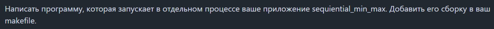

# Задание 1  

---
  
---  

```bash
@StarAres1 ➜ /workspaces/os_lab_2019 (master) $ gcc --version

@StarAres1 ➜ /workspaces/os_lab_2019 (master) $ cd lab3
@StarAres1 ➜ /workspaces/os_lab_2019/lab3 (master) $ cd src

@StarAres1 ➜ /workspaces/os_lab_2019/lab3/src (master) $ gcc -c find_min_max.c
@StarAres1 ➜ /workspaces/os_lab_2019/lab3/src (master) $ gcc -c utils.c
@StarAres1 ➜ /workspaces/os_lab_2019/lab3/src (master) $ gcc -c sequantial_min_max.c

@StarAres1 ➜ /workspaces/os_lab_2019/lab3/src (master) $ gcc find_min_max.o utils.c sequential_min_max.o -o min_max
@StarAres1 ➜ /workspaces/os_lab_2019/lab3/src (master) $ ./min_max 1 3
```

# Задание 2-3   

---

---

```bash
@StarAres1 ➜ /workspaces/os_lab_2019/lab3/src (master) $ gcc -o parallel_min_max parallel_min_max.c find_min_max.c utils.c -lm
```  


# Задание 4

---

---


# Задание 5

---

---

